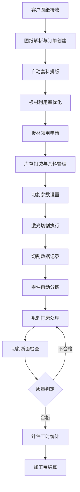

## 1. 产品概述
激光切割加工厂钣金切割业务管理客户端软件，面向钣金加工厂的生产管理人员、操作技师和财务人员，提供从图纸接收到计件结算的全流程数字化管理。
- 解决传统钣金加工中图纸管理混乱、排版效率低、板材浪费严重、切割参数靠经验、零件分拣易错、毛刺处理无记录、计件结算不透明等痛点
- 目标：提升板材利用率至90%以上，缩短排版时间50%，实现加工全流程可追溯、计件结算自动化

## 2. 核心功能

### 2.1 用户角色
| 角色 | 注册方式 | 核心权限 |
|------|----------|----------|
| 管理员 | 系统分配 | 全部模块读写权限、系统配置、用户管理 |
| 生产主管 | 系统分配 | 图纸接收、套料排版、板材领用、切割参数设置、生产调度 |
| 切割操作员 | 系统分配 | 激光切割操作、切割速度记录、气体压力监控 |
| 分拣员 | 系统分配 | 零件分拣、毛刺处理、断面检查 |
| 财务员 | 系统分配 | 计件工时统计、加工费结算、报表导出 |

### 2.2 功能模块
1. **图纸接收模块**: 客户图纸上传与解析、图纸预览、客户信息关联、订单创建
2. **套料排版模块**: 自动套料排版引擎、板材利用率计算与优化、排版方案对比、手动微调
3. **板材领用模块**: 板材库存管理、领用申请与审批、余料管理、板材追溯
4. **激光切割模块**: 切割气体压力监控、激光焦点设置、切割速度记录、切割参数模板
5. **零件分拣模块**: 零件自动分拣指引、分拣进度跟踪、零件标识与追溯
6. **毛刺处理模块**: 毛刺打磨处理记录、切割断面检查、质量判定、返工管理
7. **计件结算模块**: 计件工时统计、加工费自动计算、结算报表、历史记录查询

### 2.3 页面详情
| 页面名称 | 模块名称 | 功能描述 |
|----------|----------|----------|
| 工作台 | 仪表盘 | 生产概览统计、待办事项、实时设备状态、快捷入口 |
| 图纸管理 | 图纸列表 | 图纸分页列表、搜索筛选、状态标签、批量操作 |
| 图纸管理 | 图纸详情 | DXF/PDF预览、客户信息、关联订单、版本历史 |
| 图纸管理 | 上传图纸 | 拖拽上传、格式校验、自动解析、客户关联 |
| 套料排版 | 排版工作台 | 可视化排版画布、自动排版触发、利用率指标、方案管理 |
| 套料排版 | 排版方案 | 方案对比、板材规格选择、利用率分析、导出NC代码 |
| 板材管理 | 板材库存 | 库存列表、入库出库记录、库存预警、规格筛选 |
| 板材管理 | 余料管理 | 余料登记、余料复用推荐、余料利用率追踪 |
| 板材管理 | 领用申请 | 领用表单、审批流程、领用记录、库存扣减 |
| 激光切割 | 切割监控 | 实时气体压力、激光焦点参数、切割速度曲线、设备状态 |
| 激光切割 | 参数设置 | 焦点预设模板、气体压力范围、速度参数配置、材料-参数映射 |
| 激光切割 | 切割记录 | 历史切割记录、参数回溯、异常日志、效率分析 |
| 零件分拣 | 分拣指引 | 分拣任务列表、零件位置标注、分拣状态更新 |
| 零件分拣 | 分拣进度 | 批次分拣进度、完成率统计、异常标记 |
| 毛刺处理 | 处理记录 | 打磨处理登记、处理方式选择、耗时记录 |
| 毛刺处理 | 断面检查 | 检查项目清单、质量判定、照片上传、不合格返工 |
| 计件结算 | 工时统计 | 个人/班组工时汇总、工序维度统计、时间段筛选 |
| 计件结算 | 费用结算 | 加工费自动计算、结算单生成、审核确认、历史查询 |

## 3. 核心流程

用户通过工作台进入系统，按生产流程依次完成各环节操作：

1. 接收客户图纸 → 解析图纸信息 → 创建加工订单
2. 选择订单进行套料排版 → 自动/手动排版 → 确认排版方案
3. 根据排版方案领用板材 → 库存扣减 → 余料登记
4. 设置切割参数（焦点/气压/速度）→ 执行切割 → 记录切割数据
5. 零件分拣 → 扫码确认 → 更新分拣状态
6. 毛刺打磨 → 断面质量检查 → 合格入库/不合格返工
7. 计件工时统计 → 加工费结算 → 生成结算单

## 4. 用户界面设计

### 4.1 设计风格
- **主色调**: 深钢蓝 (#1B2838) 为底色，工业橙 (#FF6B35) 为强调色，体现工业制造气质
- **辅助色**: 冷灰 (#2D3748) 用于面板背景，亮绿 (#48BB78) 表示正常/完成，警示红 (#FC8181) 表示异常
- **按钮风格**: 圆角微方角(4px)，实心主按钮+描边次按钮，hover状态带微光效果
- **字体**: 标题使用 Rajdhani（工业感数字字体），正文使用 Noto Sans SC（中文优化）
- **布局风格**: 左侧固定导航栏 + 顶部面包屑 + 主内容区，卡片式模块布局
- **图标风格**: Lucide线性图标，与工业界面风格统一

### 4.2 页面设计概览
| 页面名称 | 模块名称 | UI元素 |
|----------|----------|--------|
| 工作台 | 仪表盘 | 深色背景、统计卡片网格、环形进度图、设备状态指示灯、待办列表 |
| 图纸管理 | 图纸列表 | 搜索栏+筛选器、卡片/列表视图切换、状态徽章、缩略图预览 |
| 图纸管理 | 上传图纸 | 拖拽区域虚线框、文件格式标签、上传进度条、解析状态动画 |
| 套料排版 | 排版工作台 | 深色画布、零件拖拽、利用率仪表盘、工具栏、图层切换 |
| 板材管理 | 板材库存 | 数据表格、库存条形图、预警标记、领用弹窗表单 |
| 激光切割 | 切割监控 | 实时参数仪表、压力/速度折线图、设备状态卡片、焦点示意 |
| 零件分拣 | 分拣指引 | 排版图高亮、零件列表勾选、进度条、扫码输入框 |
| 毛刺处理 | 断面检查 | 检查清单表、判定按钮组、照片上传区、返工流程指示 |
| 计件结算 | 费用结算 | 汇总数据卡、费用明细表、结算单预览、导出按钮 |

### 4.3 响应式设计
- 桌面优先设计（1920×1080基准），适配1440px和1280px
- 侧边栏可折叠，表格横向滚动
- 关键操作区域最小触控目标44px

### 4.4 3D场景指导
- 不适用（本项目为管理类应用，无3D场景需求）
