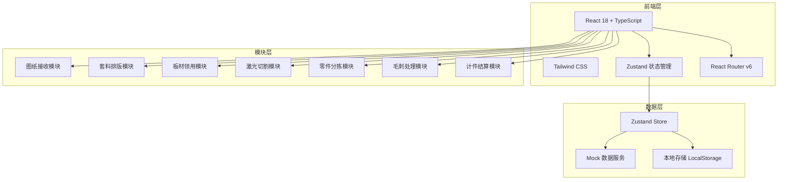
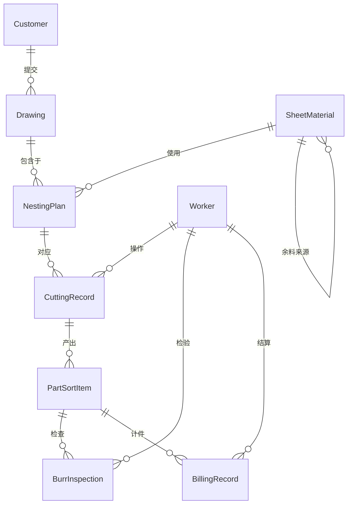

## 1. 架构设计



## 2. 技术说明
- 前端框架: React@18 + TypeScript + Vite
- 样式方案: Tailwind CSS@3 + 自定义CSS变量
- 状态管理: Zustand（轻量级全局状态）
- 路由: React Router DOM v6
- 图标库: Lucide React
- 图表: 自定义Canvas组件 + CSS动画模拟仪表
- 数据持久化: LocalStorage（Mock数据，无后端）
- 初始化工具: vite-init

## 3. 路由定义
| 路由 | 用途 |
|------|------|
| / | 工作台仪表盘 |
| /drawings | 图纸列表 |
| /drawings/upload | 上传图纸 |
| /drawings/:id | 图纸详情 |
| /nesting | 套料排版工作台 |
| /nesting/:id | 排版方案详情 |
| /sheets | 板材库存 |
| /sheets/remnants | 余料管理 |
| /sheets/requisition | 领用申请 |
| /cutting | 切割监控 |
| /cutting/params | 参数设置 |
| /cutting/records | 切割记录 |
| /sorting | 分拣指引 |
| /sorting/progress | 分拣进度 |
| /deburring | 处理记录 |
| /deburring/inspection | 断面检查 |
| /billing | 工时统计 |
| /billing/settlement | 费用结算 |

## 4. API定义
本项目为纯前端应用，使用Mock数据服务模拟后端接口。数据结构定义如下：

```typescript
interface Drawing {
  id: string
  name: string
  customer: string
  format: 'DXF' | 'PDF' | 'DWG'
  status: 'pending' | 'parsing' | 'parsed' | 'in-production' | 'completed'
  uploadTime: string
  fileSize: number
  partCount: number
  thumbnailUrl: string
}

interface NestingPlan {
  id: string
  drawingIds: string[]
  sheetSpec: string
  sheetSize: { width: number; height: number }
  utilizationRate: number
  partCount: number
  status: 'draft' | 'confirmed' | 'cutting' | 'completed'
  createdAt: string
}

interface SheetMaterial {
  id: string
  spec: string
  material: string
  thickness: number
  size: { width: number; height: number }
  stock: number
  unit: string
  isRemnant: boolean
  sourceId?: string
}

interface CuttingParams {
  id: string
  materialType: string
  thickness: number
  gasPressure: number
  focusPosition: number
  speed: number
  power: number
}

interface CuttingRecord {
  id: string
  planId: string
  operator: string
  startTime: string
  endTime: string
  avgSpeed: number
  gasPressure: number
  focusPosition: number
  status: 'running' | 'completed' | 'error'
}

interface PartSortItem {
  id: string
  drawingId: string
  partName: string
  quantity: number
  sortedCount: number
  status: 'pending' | 'sorting' | 'completed'
  location: string
}

interface BurrInspection {
  id: string
  partId: string
  inspector: string
  inspectTime: string
  burrLevel: 'none' | 'slight' | 'moderate' | 'severe'
  sectionQuality: 'excellent' | 'good' | 'acceptable' | 'poor'
  result: 'pass' | 'fail'
  remark: string
}

interface BillingRecord {
  id: string
  workerId: string
  workerName: string
  processType: string
  partCount: number
  unitPrice: number
  totalAmount: number
  workHours: number
  date: string
  status: 'pending' | 'confirmed' | 'settled'
}
```

## 5. 服务器架构图
不适用（纯前端应用，无后端服务）

## 6. 数据模型

### 6.1 数据模型定义



### 6.2 数据定义语言
使用Zustand + LocalStorage存储，核心数据结构通过TypeScript接口定义，初始化时注入Mock数据。
